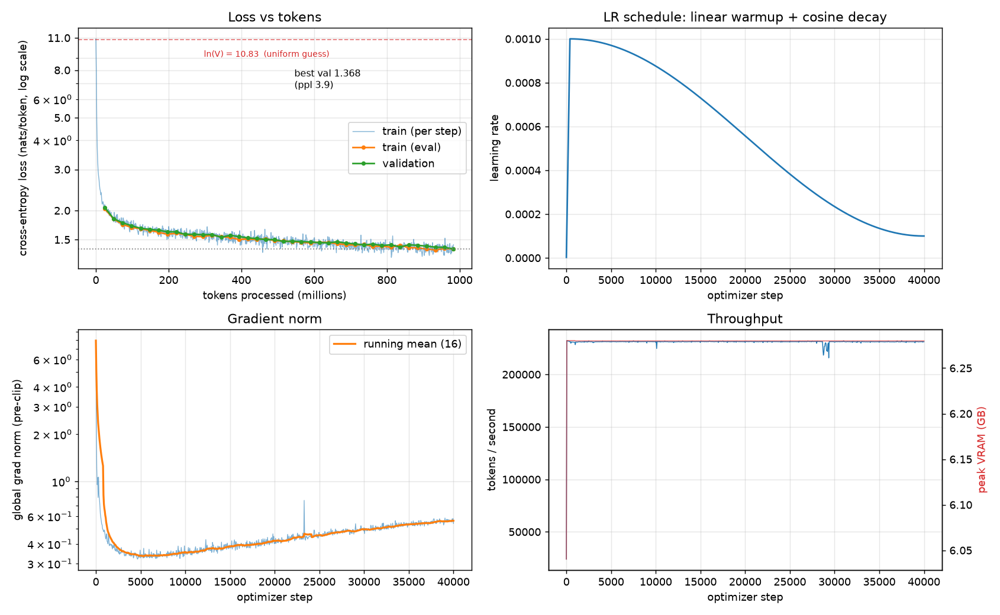
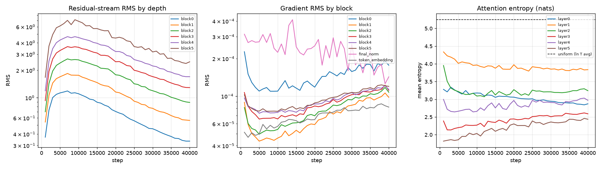
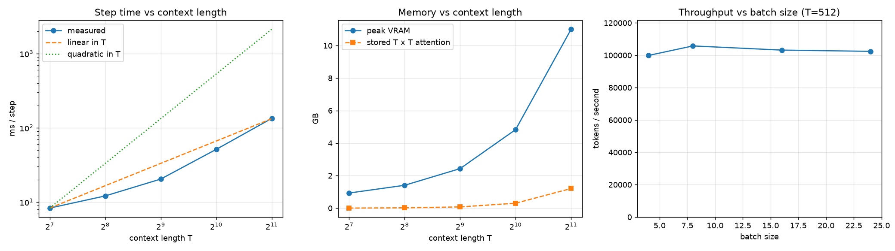

# mini-gpt — a decoder-only transformer from scratch

A small GPT built out of PyTorch primitives (`nn.Linear`, `nn.Embedding`, `matmul`,
`softmax`, `cross_entropy`) and nothing else. No `nn.Transformer`, no
`nn.MultiheadAttention`, no Hugging Face `AutoModel`/`Trainer`, no pretrained
weights, no fused attention kernel. Every tensor operation in the forward pass
is written out in [`model.py`](model.py).

The goal is understanding, so attention builds the full `[B, H, T, T]` score
matrix explicitly — you can see the quadratic cost in the code and then measure
it in [`benchmark.py`](benchmark.py).

```
tokens [B,T]
   -> token embedding            [B,T,C]
   -> N x TransformerBlock       [B,T,C]        (RMSNorm -> RoPE attention -> RMSNorm -> SwiGLU)
   -> final RMSNorm              [B,T,C]
   -> LM head (tied)             [B,T,V]
   -> cross-entropy against the next token
```

---

## Contents

| file | what it holds |
|---|---|
| [`config.py`](config.py) | `GPTConfig` (architecture) and `TrainConfig` (run), plus presets |
| [`tokenizer.py`](tokenizer.py) | thin wrapper over tiktoken's GPT-2 BPE |
| [`data.py`](data.py) | download → tokenize → flat `uint16` stream → `[B,T]` batches |
| [`model.py`](model.py) | RMSNorm, RoPE, causal self-attention, SwiGLU, block, GPT, generation |
| [`train.py`](train.py) | AdamW, warmup+cosine, AMP, grad accumulation, eval, checkpointing |
| [`generate.py`](generate.py) | greedy / temperature / top-k sampling from a checkpoint |
| [`checkpoint.py`](checkpoint.py) | save, load, exact resume, pruning |
| [`benchmark.py`](benchmark.py) | throughput / VRAM sweeps over batch size and context length |
| [`diagnostics.py`](diagnostics.py) | activation RMS, gradient RMS, attention entropy |
| [`plots.py`](plots.py) | matplotlib curves from `log.jsonl` |
| [`tests/`](tests) | 75 targeted tests, including the tiny-batch overfit check |

`diagnostics.py` and `plots.py` are the two files beyond the plan's file list;
they exist to satisfy the required diagnostics and visualisations without
bolting an observability framework onto the training loop.

## Quickstart

```bash
uv venv .venv
uv pip install --index-strategy unsafe-best-match \
    --extra-index-url https://download.pytorch.org/whl/cu128 \
    torch tiktoken numpy matplotlib pytest

python data.py --dataset tinystories        # ~1.9 GB download, ~5 min to tokenize
python -m pytest tests -q                   # 75 tests, ~2 s
python train.py --overfit                   # sanity check: memorise one batch
python train.py --preset small --compile --diagnostics
python generate.py --ckpt runs/tinystories/best.pt --prompt "Once upon a time"
python benchmark.py
python plots.py --run runs/tinystories --benchmark runs/benchmark.json
```

---

# Architecture

Shape notation used everywhere in the code:

```
B  = batch size            H  = n_heads
T  = sequence length       Dh = d_head        (H * Dh == C here)
C  = d_model               V  = vocab_size
```

## Token embeddings

```python
token_embedding = nn.Embedding(vocab_size, d_model)   # [V, C]
```

`[B,T]` int64 ids → `[B,T,C]` float vectors. This is a lookup table, not a
matmul: row `v` is the model's starting guess about what token `v` means, before
any context is applied.

There is **no learned positional embedding table**. Position enters only through
RoPE, inside attention. A `test_no_positional_embedding_table` test asserts this.

## RMSNorm

```
RMS(x) = sqrt(mean_i(x_i^2) + eps)
y      = x / RMS(x) * g
```

Normalises over the last dimension only. One learned scale vector `g` of size
`C`, no bias, no mean subtraction.

- **Inputs/outputs:** `[..., C]` → `[..., C]`.
- **Parameters:** `C`.
- **Why:** it fixes the *scale* of each token's activation vector so the next
  layer's matmul sees a predictable input magnitude, regardless of how much the
  residual stream has accumulated. Without it, the residual stream grows with
  depth and the network's effective learning rate drifts layer by layer.
- **Versus LayerNorm:** dropping the mean subtraction and the bias costs nothing
  in quality and removes two reductions. LayerNorm's mean-centering is not
  what makes normalisation work; the scale control is.
- **Complexity:** `O(B*T*C)`.
- **Backward:** the gradient gets projected orthogonally to `x` and rescaled by
  `1/RMS(x)` — which is exactly the mechanism that stops a large activation from
  producing a large gradient.
- **Remove it:** deep pre-norm stacks stop training; loss plateaus or diverges.

Computed in fp32 even under bf16 autocast: the sum of squares is the one
reduction in this layer where low precision actually costs accuracy.

## RoPE (rotary position embeddings)

Each head's `Dh` channels are read as `Dh/2` two-dimensional planes. Plane `i`
at position `t` is rotated by angle `t * theta^(-2i/Dh)`:

```
[ x'_2i   ]   [ cos(t w_i)  -sin(t w_i) ] [ x_2i   ]
[ x'_2i+1 ] = [ sin(t w_i)   cos(t w_i) ] [ x_2i+1 ]
```

- **Applied to Q and K only, never V.** RoPE must change *where* a token looks,
  not *what* it carries. Rotating V would corrupt the payload being moved.
- **Inputs/outputs:** `[B,H,T,Dh]` → `[B,H,T,Dh]`.
- **Parameters:** none. `cos`/`sin` are precomputed non-persistent buffers of
  shape `[context_length, Dh/2]`.
- **Why:** the resulting dot product `<R_m q, R_n k>` depends only on `m - n`.
  Position becomes *relative* and is expressed as a rotation, so it costs no
  parameters, adds no magnitude, and extrapolates more gracefully than a learned
  table. `test_dot_product_depends_only_on_relative_position` checks this
  directly.
- **Complexity:** `O(B*H*T*Dh)`.
- **Backward:** a rotation is orthogonal, so the backward pass is the inverse
  rotation — it cannot amplify or shrink gradients. `||R x|| == ||x||`.
- **Remove it:** with no positional signal at all, attention becomes permutation
  equivariant — the model sees a bag of tokens and language modelling collapses.

Fast frequencies (`i` near 0) spin once per token and encode fine local order;
slow frequencies (`i` near `Dh/2`) barely move across the whole context and
encode coarse absolute-ish position.

## Causal self-attention

```python
q = q_proj(x)                                  # [B, T, H*Dh]
q = q.view(B, T, H, Dh).transpose(1, 2)        # [B, H, T, Dh]      (same for k, v)
q, k = apply_rope(q, cos, sin), apply_rope(k, cos, sin)

scores = q @ k.transpose(-2, -1) / sqrt(Dh)    # [B, H, T, T]
scores = scores.masked_fill(~tril, -inf)       # causality
attn   = softmax(scores.float(), -1)           # [B, H, T, T]
y      = attn @ v                              # [B, H, T, Dh]
y      = y.transpose(1, 2).reshape(B, T, H*Dh) # [B, T, C]
y      = out_proj(y)                           # [B, T, C]
```

- **Parameters:** `4 * C * (H*Dh)` — separate `q_proj`, `k_proj`, `v_proj` (a
  fused QKV matrix is faster but hides which third is which) plus `out_proj`.
- **Why `/sqrt(Dh)`:** for unit-variance `q` and `k`, the dot product of `Dh`
  terms has variance `Dh`. Without the scaling, the softmax saturates as `Dh`
  grows, gradients vanish, and the layer stops learning.
- **Why the mask:** position `i` may only attend to `j <= i`. Setting the rest to
  `-inf` *before* the softmax makes them exactly zero after it (not merely
  small), so no gradient path exists from a future token to an earlier output.
- **Why multiple heads:** one softmax produces one convex combination of value
  vectors per query. `H` heads give `H` independent retrieval patterns per layer
  at the same total width, so a token can copy a subject, a verb tense and a
  bracket depth in one layer instead of three.
- **Complexity:** `O(B*H*T^2*Dh)` FLOPs, and — the part that hurts —
  `O(B*H*T^2)` *memory*, since the softmax output must be kept for backward.
  This term is what FlashAttention removes by recomputing tiles instead of
  storing the matrix.
- **Backward:** softmax's Jacobian mixes every key position of a row, so an
  error at output `i` is redistributed to every `j <= i` in proportion to how
  much attention it received.
- **Remove it:** the model becomes a stack of position-wise MLPs — no token can
  see any other, and next-token prediction is reduced to unigram statistics.

The softmax runs in fp32 (`scores.float()`) even under bf16 autocast; the
exponential is the numerically delicate step in the block.

## SwiGLU feed-forward

```
SwiGLU(x) = ( SiLU(x W_gate) * (x W_up) ) W_down
```

- **Inputs/outputs:** `[B,T,C]` → `[B,T,C]`; hidden width `d_ff`.
- **Parameters:** `3 * C * d_ff`.
- **Why `d_ff > C`:** attention only *moves* information between positions; the
  FFN is the only place a token transforms its own content. That computation
  needs room — a wider intermediate space to separate features in before
  projecting back down into the narrow residual stream that every layer shares.
- **Why gated:** the elementwise product makes one branch a data-dependent gate
  on the other, so the layer can suppress or pass a feature conditionally
  instead of applying one fixed pointwise curve.
- **Why `d_ff = 8/3 * C` and not `4C`:** SwiGLU uses three matrices where a
  GELU FFN uses two. `8/3 * C` keeps the parameter count (and FLOPs) equal to a
  `4C` two-matrix FFN, so the comparison is like-for-like. Here
  `8/3 * 384 = 1024`.
- **Complexity:** `O(B*T*C*d_ff)`, linear in `T` — this, not attention,
  dominates the FLOP count at short context.
- **Remove it:** roughly two-thirds of the parameters disappear and the model
  loses almost all of its per-token nonlinear capacity.

`GELUFFN` is kept in `model.py` as the phase-1 baseline and is selectable with
`--ffn-type gelu` for an ablation.

## Transformer block (pre-norm)

```python
x = x + attn(norm1(x))
x = x + ffn(norm2(x))
```

Normalising the *input* of each sublayer rather than the output of the residual
add leaves an unnormalised identity path from the embeddings straight to the LM
head. That path is why deep stacks train without a delicate warmup — the
gradient reaches layer 0 undiminished. `test_block_residual_path_exists` zeroes
both output projections and checks the block becomes the identity.

The residual stream is `[B,T,C]` at every point in the block; nothing changes
its shape. Both `out_proj` and `down_proj` — the two matrices that *write into*
the stream — are initialised with std scaled by `1/sqrt(2*n_layers)`, so the
stream's variance does not grow linearly with depth.

## LM head and loss

The head is `nn.Linear(C, V, bias=False)`, and with `tie_embeddings=True` its
weight **is** the embedding matrix. The same matrix is a lookup table on the way
in and a similarity score against every vocabulary item on the way out. At
`V=50257, C=384` that saves 19.3M parameters — 65% of this model.

```python
loss = F.cross_entropy(logits.reshape(-1, V), targets.reshape(-1))
```

`[B,T,V]` → `[B*T,V]` against `[B*T]`. The data loader already produces
`y = tokens[i+1 : i+T+1]`, so the prediction made at position `t` is scored
against the token that actually followed it. At initialisation the loss should
be ≈ `ln(V) = 10.83`, and it is (10.84 measured) — a cheap check that the head
is not accidentally confident.

---

# Training configuration

| | |
|---|---|
| parameters | **29,920,512** (10,621,824 non-embedding) |
| layers / d_model / heads | 6 / 384 / 6 × 64 |
| FFN | SwiGLU, `d_ff` = 1024 |
| context length | 512 |
| tokenizer / vocab | tiktoken GPT-2 BPE, 50257 |
| dataset | TinyStories (2,119,489 stories → **463.8M** train tokens, 4.67M val) |
| micro batch / grad accum | 24 / 2 → effective batch 48 |
| tokens per optimizer step | 24,576 |
| optimizer | AdamW, β=(0.9, 0.95), ε=1e-8, fused |
| learning rate | peak 1e-3, 400-step linear warmup, cosine to 1e-4 |
| weight decay | 0.1 on matrices only (not RMSNorm scales) |
| gradient clipping | global norm 1.0 |
| precision | fp32 params/optimizer, bf16 autocast |
| hardware | 1 × RTX 5070 Ti (16 GB, sm_120), torch 2.14 + cu130 |

## Optimizer parameter groups

Every parameter with `dim() >= 2` (all the `Linear` and `Embedding` matrices)
gets weight decay; every 1-D parameter (RMSNorm scales, any biases) gets none.
Decaying a norm scale toward zero fights the layer's entire purpose, and
decaying a bias adds a constant pull with no regularising effect. Tied weights
are deduplicated by `id()` so the shared matrix is not decayed twice — a
`test_optimizer_counts_tied_weights_once` test pins that down.

## Mixed precision — what is in which dtype

| tensor | dtype |
|---|---|
| parameters, AdamW moments, the optimizer update | fp32, always |
| matmuls (projections, scores, FFN) | bf16 under autocast |
| RMSNorm reduction | fp32 (explicit `.float()`) |
| attention softmax | fp32 (explicit `.float()`) |
| cross-entropy | fp32 (explicit `.float()`) |
| logits returned to the caller | bf16 |

bf16 has the same exponent range as fp32, so it needs **no** `GradScaler`.
`setup_precision()` still builds one and enables it only for fp16, where the
narrower range makes gradient underflow real. `train.py` checks the loss for
`NaN`/`Inf` each logging interval and aborts loudly rather than burning an hour
on a diverged run.

## Gradient accumulation

Each micro-batch loss is divided by `grad_accum_steps` before `backward()`, so
the accumulated gradient equals the gradient of the mean loss over the whole
effective batch. `test_gradient_accumulation_equals_one_big_batch` verifies this
against a single forward over the concatenated batch, to 1e-5.

Gradients are unscaled *before* clipping (`scaler.unscale_` then
`clip_grad_norm_`) — clipping scaled gradients would clip to the wrong norm.

---

# Results

The headline run: 40,000 optimizer steps, **983M tokens** (2.1 epochs over
TinyStories), **73 minutes** wall clock on one RTX 5070 Ti.

| | |
|---|---|
| final train loss (eval, 40 batches) | **1.3678** |
| final validation loss | **1.3684**  (perplexity **3.93**) |
| best validation loss | 1.3684 at step 39,999 |
| train − val gap | **−0.0006** — no overfitting at 2.1 epochs |
| loss at initialisation | 10.8914 vs. `ln(50257)` = 10.825 |
| median throughput | **231,197 tokens/sec** (106.3 ms/step) |
| peak VRAM (training step) | **6.28 GB** of 16.6 GB |
| gradient norm | 7.90 at step 0 → 0.35 by step 5,000 → 0.54 at the end |
| checkpoint size | 343 MB (weights + AdamW moments + RNG state) |

Validation loss fell monotonically the whole way — 2.058 → 1.580 → 1.501 →
1.423 → 1.368 at 25M / 246M / 492M / 737M / 983M tokens — and was still
improving when the cosine schedule ran out. The train and validation curves sit
on top of each other for the entire run, which is what you expect from a 30M
model on a 464M-token corpus: at this ratio the model is capacity-limited, not
data-limited.

## Where the parameters are

| | | |
|---|---:|---:|
| token embedding (= LM head, tied) | 19,298,688 | 64.5% |
| attention `q,k,v,out` (6 layers) | 3,538,944 | 11.8% |
| SwiGLU `gate,up,down` (6 layers) | 7,077,888 | 23.7% |
| RMSNorm scales (13 vectors) | 4,992 | 0.0% |
| **total** | **29,920,512** | |
| non-embedding | 10,621,824 | |

Two thirds of the model is the vocabulary. Of the part that actually computes,
the FFN is twice the size of attention.

## Training curves



Loss vs. tokens (log axis, with the `ln(V)` uniform-guess baseline marked), the
LR schedule, the gradient norm, and throughput/VRAM. Throughput is flat at
231k tokens/sec for the whole run.

## Diagnostics



Three things worth reading off these:

- **Residual-stream RMS is strictly ordered by depth at every step** — block 0
  is always the smallest, block 5 always the largest, because each block only
  ever *adds* to the stream. It rises until ~step 8,000 and then decays as the
  learning rate comes down and weight decay wins.
- **Gradient RMS stays within a factor of ~4 across all six blocks** and never
  trends toward zero at the early layers. That is the pre-norm residual path
  doing its job; there is no vanishing-gradient problem to solve here.
- **Attention entropy splits by depth, and not in one direction.** Everything
  starts near the uniform reference (5.25 nats) and drops fast. But over
  training layers 0–2 keep sharpening (3.28 → 2.87, 4.34 → 3.84, 3.95 → 3.24)
  while layers 3 and 5 move the other way (2.39 → 2.59 and 1.82 → 2.44). The
  deepest layer starts as the sharpest — nearly a hard lookup — and then
  *relaxes*, learning to blend several pieces of evidence rather than copy one.
  No head is stuck at the uniform value, so no head is idle.

## Example generations

All from `runs/tinystories/best.pt`. Prompt in **bold**.

**Greedy** (`--greedy`) — coherent, and visibly the "safest" continuation:

> **Once upon a time**, there was a little girl named Lily. She loved to play
> outside in the park. One day, she saw a big, scary dog. The dog barked loudly
> and Lily got scared. She ran away and hid behind a tree.
> Suddenly, a kind lady came to the park. She saw Lily and asked her what was
> wrong. Lily told her about the scary dog. The lady said, "Don't worry, I'll
> help you." She went to the dog and said, "Don't be scared, I'll protect you."
> The dog stopped barking and wagged his tail.
> The lady took Lily's hand and they walked together to the dog. The dog licked
> Lily's face and she laughed. They became friends and…

**Temperature 0.8, top-k 50** — dialogue, a consistent cast, and a resolution:

> **Once upon a time**, there was a little girl named Lily. She loved to play in
> her room with her toys. One day, her mom came in and said, "Lily, it's time to
> clean up your toys." Lily replied, "But Mom, I want to play more. I don't want
> to do it."
> Her mom said, "Lily, we need to clean up our toys so we can keep playing. Can
> you please clean up your toys and put them away in their proper place?"
> Lily thought for a moment and said, "Okay, Mom. I will clean up my toys and
> put them away in the right place."

**A prompt the corpus never contained:**

> **The dragon looked at the tiny mouse and said** "Hello! I am a gentle dragon.
> Can I be your friend?". The mouse was so excited! He said "Yes! You can be my
> friend!".
> The dragon and the little mouse became fast friends. They played games and
> flew around the track together. […]

**Temperature 1.4 with no top-k** — the failure mode, included deliberately:

> **Once upon a time**, Tom, a small frog, saw a salad. The salad was healthy,
> but Tom passports birds or her babies adding. […] The planapy kingIsn perfectly
> full unaware of work was becoming a fo Islamists fantascut� residencyAdamrl Lay
> ears eating can sing Sylvia/. jetsmg PUBLIChan bis empty KP Kara routinely

It degrades over about two sentences. Flattening the distribution hands
meaningful aggregate probability to the ~50,000 tokens in the tail that
TinyStories never uses, and once one of them is sampled the context is
off-distribution and the model never recovers. This is the whole argument for
top-k in one paragraph.

The model also learned document boundaries: several samples emit
`<|endoftext|>` and cleanly begin a new, unrelated story.

[`assets/samples_during_training.txt`](assets/samples_during_training.txt) has a
fixed-prompt sample every 2,500 steps, so
the progression is recorded across the run. By step 2,500 (61M tokens) the
output is already grammatical, on-topic, and story-shaped.

The full set of final generations, with the exact commands that produced them,
is in [`assets/final_generations.txt`](assets/final_generations.txt).

## Performance benchmark

Measured **eager** (not `torch.compile`d), so the numbers describe the naïve
attention implementation as written. `--steps 8` per configuration.

### Batch size (T = 512)

| B | tok/step | ms/step | tokens/sec | TFLOP/s | peak VRAM | T×T attn | attn % mem | attn % FLOPs |
|--:|--:|--:|--:|--:|--:|--:|--:|--:|
| 4 | 2,048 | 20.5 | 99,857 | 19.3 | 2.44 GB | 0.08 GB | 3.1% | 7.3% |
| 8 | 4,096 | 38.7 | 105,749 | 20.5 | 4.37 GB | 0.15 GB | 3.5% | 7.3% |
| 16 | 8,192 | 79.4 | 103,174 | 20.0 | 8.24 GB | 0.30 GB | 3.7% | 7.3% |
| 24 | 12,288 | 120.0 | 102,405 | 19.8 | 12.11 GB | 0.45 GB | 3.7% | 7.3% |
| 32 | — | — | OOM | | | | | |

Throughput is **flat** from B=4 to B=24. The GPU is already saturated at the
smallest batch; a larger micro-batch buys nothing but memory pressure. Use
gradient accumulation to grow the effective batch instead.

### Context length (B = 4) — the quadratic term arriving

| B | T | ms/step | tokens/sec | peak VRAM | T×T attn | attn % mem | attn % FLOPs | growth per doubling |
|--:|--:|--:|--:|--:|--:|--:|--:|--|
| 4 | 128 | 8.3 | 61,692 | 0.93 GB | 0.003 GB | 0.5% | 1.9% | — |
| 4 | 256 | 12.1 | 84,668 | 1.41 GB | 0.01 GB | 1.3% | 3.8% | ms ×1.46, attn mem ×4 |
| 4 | 512 | 20.4 | 100,393 | 2.43 GB | 0.08 GB | 3.1% | 7.3% | ms ×1.69, attn mem ×4 |
| 4 | 1024 | 51.2 | 79,934 | 4.83 GB | 0.30 GB | 6.2% | 13.6% | ms ×2.51, attn mem ×4 |
| 4 | 2048 | 133.8 | 61,222 | 11.01 GB | 1.21 GB | 11.0% | 24.0% | ms ×2.61, attn mem ×4 |
| 4 | 4096 | — | **OOM** | | | | 38.7% | |



This is the demonstration the project was built for:

- **Step time crosses over.** Doubling `T` costs ×1.46 at first — *less* than
  linear, because a short sequence does not saturate the GPU. By T=1024→2048 it
  costs ×2.61 and is heading for ×4. The measured curve starts below the linear
  reference line and crosses it at T=2048.
- **Throughput peaks and then falls.** 100k tokens/sec at T=512, 80k at 1024,
  61k at 2048. Past the crossover, longer context makes the model process
  *fewer* tokens per second, not more.
- **Attention memory quadruples on every doubling**, exactly ×4.00 each time,
  while everything else doubles.
- **T=4096 does not fit at all** in 16 GB at batch 4.

The nuance worth keeping: at T=512 the `[B,H,T,T]` matrices are only 3.7% of
peak memory. What actually fills the GPU at this scale is the `[B,T,V]` logits
tensor — at B=24, T=512, V=50257 that is 1.2 GB in bf16 plus a 2.5 GB fp32 copy
for the cross-entropy. With a 50k vocabulary and a 384-wide model, the
*vocabulary* is the memory problem and attention is a rounding error. Attention
only takes over as `T` grows, which is precisely the regime FlashAttention was
built for.

---

# Tests

```
python -m pytest tests -q
```

| file | covers |
|---|---|
| `test_rmsnorm.py` | shape, unit RMS output, scale applied, scale invariance, no bias, no mean subtraction |
| `test_rope.py` | shapes, cache shape, position-0 identity, determinism, norm preservation, distinct rotations per position, relative-position dot product, hand-checked 2-D rotation |
| `test_attention.py` | output shape, lower-triangular mask, rows sum to 1, zero mass above the diagonal, first token attends only to itself, future edits don't change the past, **gradient causality**, `1/sqrt(Dh)` scaling reproduced by hand, block shape preservation, residual identity |
| `test_ffn.py` | SwiGLU formula, gating, wider hidden dim, parameter counts, GELU variant, position-wise independence |
| `test_model.py` | forward shapes, init loss ≈ `ln V`, gradients reach every parameter, `last_token_only` consistency, weight tying, no positional table, RoPE cache is a non-persistent buffer, **shared-prefix causality**, gradient causality, variable `T`, batch independence, generation shapes, greedy determinism, top-k restriction, temperature→greedy limit, hand-computed parameter count |
| `test_data.py` | batch shapes/dtype, **`y` is `x` shifted by exactly one**, contiguous windows, never reads past the end, sampler state restore, tokenizer round-trip |
| `test_training.py` | loss matches manual cross-entropy, target alignment, LR schedule shape and monotonicity, optimizer groups, tied-weight dedup, **grad accumulation == one big batch**, clipping bounds the norm, **tiny-batch overfit**, no NaN/Inf under bf16 |
| `test_checkpoint.py` | save/load round-trip, rebuilt model is identical, **resume reproduces uninterrupted training exactly**, optimizer moments restored, RNG restored, pruning |

The two most valuable are `test_tiny_batch_overfit` (it fails loudly for a
broken mask, misaligned targets, a detached graph, or a dead optimizer) and
`test_resume_reproduces_uninterrupted_training` (train 20 straight vs. 10 +
save/reload + 10, then compare every parameter).

---

# Lessons learned

## Bugs encountered

**The tiny-batch overfit test that could not reach zero — and it was not the model.**
`test_tiny_batch_overfit` drove the loss to 0.001 but greedy accuracy stuck at
127/128 tokens. The batch was `torch.randint(0, 64, (4, 32))`, and rows 0 and 3
both began with token `55` while wanting different targets at position 0.
Position 0 can condition on nothing but `x[:, 0]`, so those two rows demanded
two different outputs from one identical input: genuinely unlearnable, and it
caps the achievable loss above zero forever. The fix was one line
(`idx[:, 0] = torch.arange(4)`), but the symptom — "my model can't overfit a
tiny batch" — is exactly what a broken causal mask looks like. Worth knowing
before spending an evening auditing attention.

**Throughput spikes of 11.5M tokens/sec.** The first training-curve plot showed
the tokens/sec line jumping two orders of magnitude every 1000 steps. The
logging code divided the elapsed interval by `log_interval`, but evaluation,
sampling and checkpointing all reset the timer mid-interval, so a 1-step
interval was being divided by 50. Tracking the step index the interval started
after (`last_timed_step`) fixed it. The lesson is that the plot found the bug —
the numbers in the log looked plausible enough line by line.

**Peak VRAM contaminated by the diagnostics pass.** `max_memory_allocated()` is
a high-water mark that never falls. The diagnostics forward pass holds a
`[B, H, T, T]` attention tensor for every layer at once, so once it ran, every
later VRAM reading in the run inherited that peak (6.3 GB jumping to 9.3 GB and
staying). Resetting the peak alongside the timer makes the logged number a
measure of the training step again.

**Silent progress.** `python train.py > log.txt` produced an empty file for
minutes: Python block-buffers stdout when it is not a TTY.
`sys.stdout.reconfigure(line_buffering=True)` fixes it. Trivial, and extremely
annoying while trying to watch a run's first minutes.

## Surprising behaviours

**Weight tying makes the model non-uniform at step 0.** Checking the initial
loss against `ln(V)` is the standard sanity check, but the first measurement
came out at 9.30 instead of 10.83 — because the check was run with
`targets == inputs`. With tied embeddings the residual stream still carries the
input embedding at the final norm, and the LM head *is* that embedding matrix,
so an untrained tied model is already good at predicting the token it was just
shown. Against genuine next-token targets it measures 10.84, as it should.
An untied model does not have this property.

**Attention entropy is a live specialisation readout.** At initialisation every
head sits at the uniform reference (2.548 vs. ln-T average 2.549 on the debug
config) — heads are averaging over everything visible. Within 1000 steps the
layers separate: early layers stay diffuse while the last layer's heads sharpen
to ~1.2 nats. A head still pinned at the uniform value late in training is a
head doing nothing.

**The gradient norm goes back up.** It falls from 7.90 to a minimum of 0.32
around step 4,650 and then climbs steadily for the rest of the run, ending at
0.54 — a 70% increase across the second half of training, while the loss is
still falling. It is easy to read a rising gradient norm as instability, but
here it is the cosine schedule: as the learning rate decays the model settles
into a sharper region of the loss surface, where the same loss improvement
corresponds to a larger gradient. Per-block gradient RMS rises in lockstep
across all six blocks (see the diagnostics plot), which is what distinguishes
this from a single layer blowing up.

**Naïve attention is not what fills the GPU at this scale.** The whole point of
building the explicit `[B, H, T, T]` matrix was to feel the quadratic cost, and
at `T = 512` it is only 0.45 GB out of 12.1 GB — 3.7% of peak memory and 7.3%
of FLOPs. What actually dominates is the `[B, T, V]` logits tensor: at
`B=24, T=512, V=50257` that is 1.2 GB in bf16 plus a 2.5 GB fp32 copy for the
cross-entropy. With a 50k vocabulary and a 384-wide model, the *vocabulary* is
the memory problem and attention is a rounding error. The quadratic term only
takes over as `T` grows — measured attention FLOP share: 1.9% at `T=128`, 7.3%
at 512, 13.6% at 1024, 24.0% at 2048, 38.7% at 4096. That is the honest version
of "attention is quadratic": it is a statement about scaling, not about where
your memory went today.

## Stability

Nothing diverged. The combination that made a 1e-3 peak LR safe on a 6-layer
model was ordinary: 400 steps of linear warmup, cosine decay to 0.1×, global
gradient clipping at 1.0, and `1/sqrt(2*n_layers)` scaling on the two
projections that write into the residual stream. The gradient norm starts at
7.90 and falls below the 1.0 clip threshold within ~350 steps; clipping engaged
**only during warmup** and never again in the remaining 39,650 steps. bf16
needed no loss scaler, and no NaN or Inf was ever observed; the explicit fp32
islands (RMSNorm reduction, attention softmax, cross-entropy) are cheap
insurance and there is no reason to remove them.

## Bottlenecks and what changed throughput

| change | tokens/sec | peak VRAM |
|---|---|---|
| eager, `micro_batch=16` | 103,244 | 8.24 GB |
| `torch.compile`, `micro_batch=16` | 232,295 | 4.27 GB |
| `torch.compile`, `micro_batch=24` | 234,716 | 6.16 GB |
| `torch.compile`, `micro_batch=48` | 222,267 | 11.81 GB |

`torch.compile` was worth **2.25×** and simultaneously cut memory by 48%. Both
come from the same place: the mask → softmax → dropout chain and the SwiGLU
elementwise product get fused, so the intermediates never become full tensors
in HBM. It compiles our own code — nothing about the implementation is hidden
by it.

Batch size, by contrast, bought almost nothing. Throughput is flat from 24 to
48 sequences because the GPU is already saturated; the only thing a larger
micro-batch changes is how much VRAM is occupied. The useful knob for effective
batch size is therefore gradient accumulation, not a bigger micro-batch.

## What changed training quality

The pieces that mattered, roughly in order:

1. **Getting the target alignment right.** Everything else is moot if `y` is not
   `x` shifted by exactly one token. This is one assertion in a test and the
   difference between a language model and a noise generator.
2. **Weight tying.** 19.3M of 29.9M parameters — 65% of the model — is the
   embedding matrix. Tying it to the LM head halves the parameter count at no
   measurable cost, and gives the optimizer twice as much signal per row.
3. **Warmup.** Adam's second-moment estimate is meaningless for the first few
   dozen steps; taking full-size steps then is the classic way to lose a run.
4. **Selective weight decay.** Decaying RMSNorm scales toward zero works against
   the layer's only job.
5. **The FFN width.** Two-thirds of the non-embedding parameters live in
   SwiGLU. Attention moves information between positions; this is where the
   model actually computes.

## What I would do next

- **KV caching** in `generate`, which currently recomputes the entire context
  for every token — `O(T^2)` per token, `O(T^3)` for a sequence.
- **FlashAttention** (or just `F.scaled_dot_product_attention`), now that the
  benchmark shows exactly where the `T^2` term starts to matter.
- **A harder corpus.** TinyStories has a deliberately tiny effective vocabulary;
  a FineWeb-Edu subset would show whether the architecture holds up when the
  data is not synthetic. `data.py`'s `DATASETS` dict is where that goes.
- **The ablations the config already supports**: `--ffn-type gelu` and
  `--no-tie`, both one flag away.
